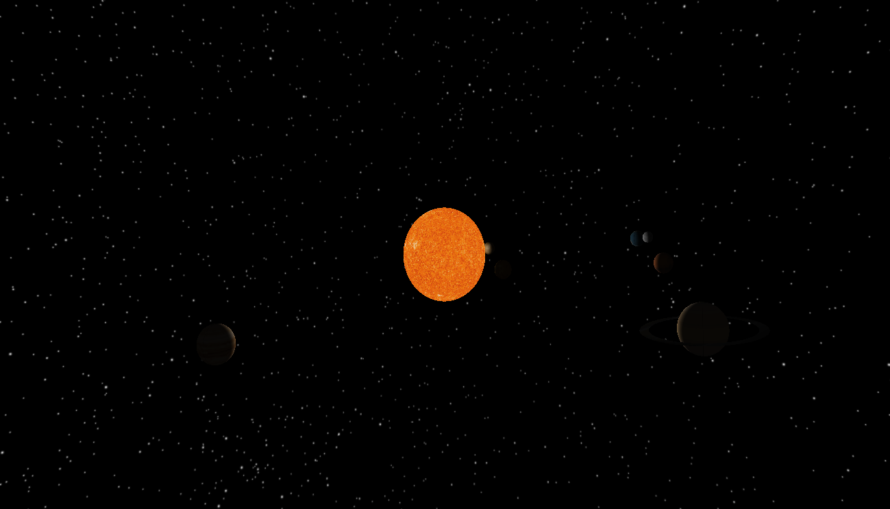

# Solar System Simulation

A simple simulation of our solar system with uniformly(ish)
spaced planets and logarithmically(ish) scaled objects!

## Dependencies
- SOIL (Simple OpenGL Image Library)
- freeglut

## Features
- Moveable camera
- Elliptical orbits
- Rotation about planets' axes
- Axial tilt
- Inclined orbital planes
- Textures
- Lighting
- Background
- Saturn has a ring

## Planned Features
- More physics / less hardcode
- Switch from OpenGL's immediate mode to core-profile mode
- Ability to easily make new solar systems
- Menus
- A fancier load screen
- Various bells and whistles!

## Camera Controls
- w: increase altitude
- s: decrease altiude
- a: move clockwise
- d: move counterclockwise
- -: zoom out
- =: zoom in

## Version 1.0
